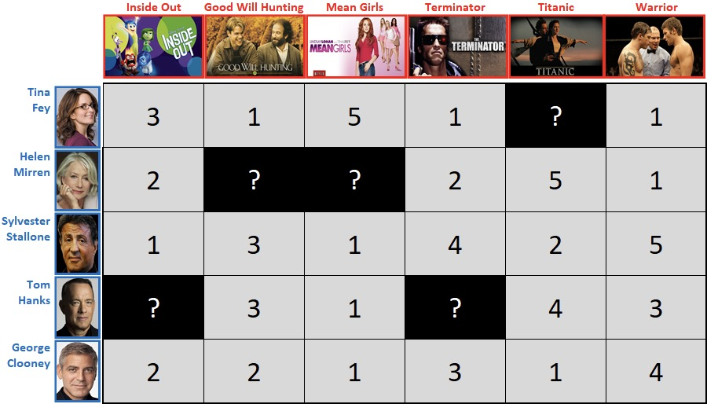
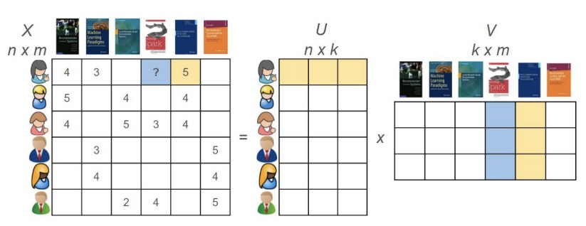
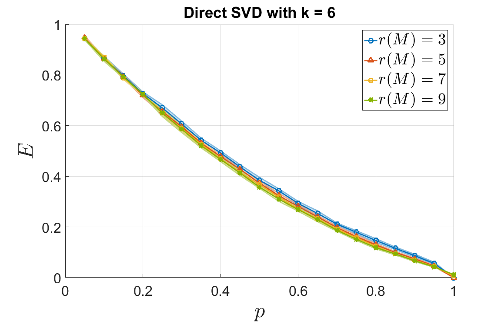
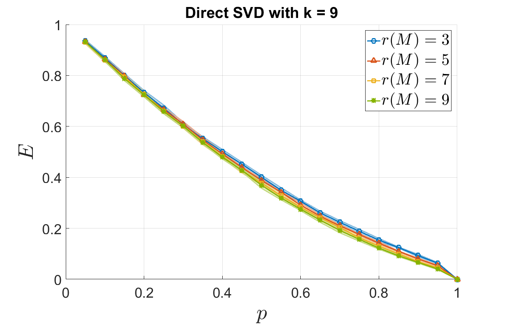
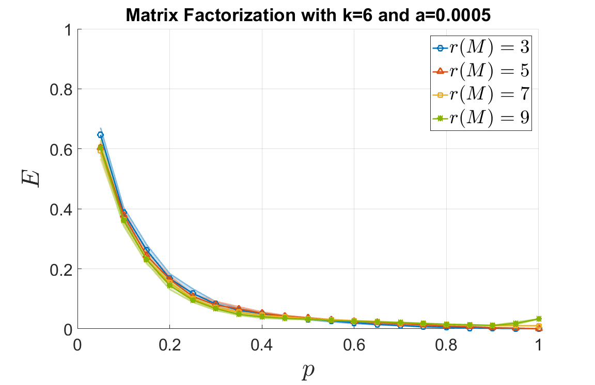
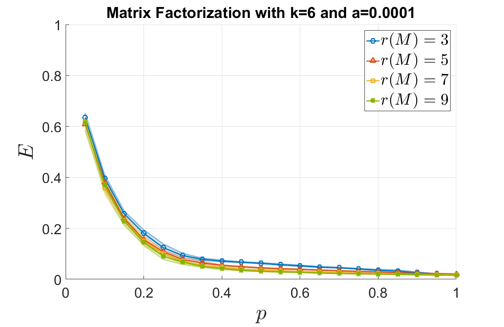
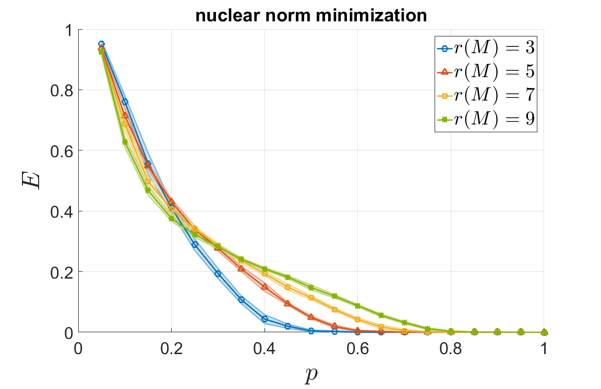
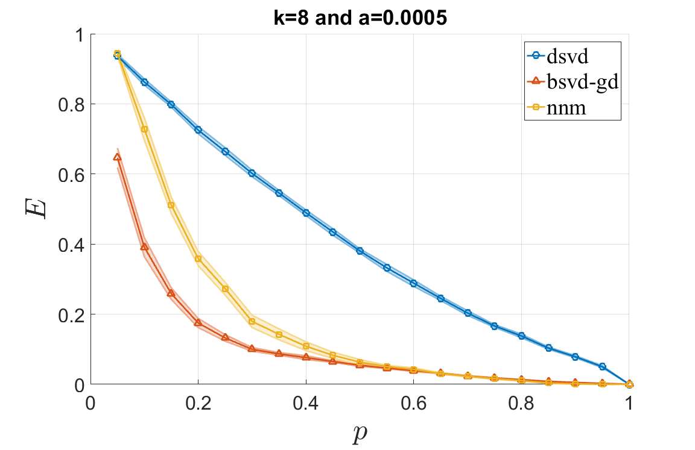

# Introduction 

Nowadays recommendation systems are everywhere in various social media platforms. In
general, a recommendation system utilizes user data to recommend items that the user may
have an interest in. For example, a movie platformlike Netflix will display videos that are related
to what you have watched recently, a music app like Spotify will recommend new songs everyday
based on your previous preferences, these are contributions of recommendation systems.

Numerous methods have been developed for recommendation systems and they mainly fall
into three categories: collaborative filtering, content-based filtering, and hybrid approaches.
Collaborative filtering is a method assuming that similar users will have similar interests and
thus recommend items that have been liked by similar users, content-based filtering explores
items with similar content and recommends users similar items to what they have liked.

## Model

This project is focused on **collaborative filtering** approaches, most of which could be modeled
as a matrix completion problem where the matrix is a user-item matrix composed of each
user’s rating for each item. 

<picture>
  <source media="(prefers-color-scheme: dark)" srcset="./images/movie.jpeg" width="600">
  
</picture>

*A Survey of Matrix Completion Methods for Recommendation Systems*
(A. Ramlatchan, M. Yang, Q. Liu, M. Li, J. Wang and Y. Li) gives a comprehensive summary
to various matrix completion methods used in recommendation systems, this project is going
to focus on the matrix factorization models. 

The matrix factorization models are based on the idea of **Singular Value Decomposition**, 
which decompose the sparse data matrix into a userfeature matrix and an item-feature matrix which capture 
the latent relationship between users and items, then uses the dot product of these latent vectors 
to obtain the prediction at a certain entry.

<picture>
  <source media="(prefers-color-scheme: dark)" srcset="./images/SVD.jpeg" width="600">
  
</picture>

# Matrix Factorization

Now our problem of interest is, given a large and sparse data matrix $\mathbf{A} \in \mathbb{R}^{m\times n}$, how can we recover it and get a complete matrix? This section will explain the three main methods my project investigates. 

Given a data matrix $\mathbf{A} \in \mathbb{R}^{m\times n}$ where the rows of $\mathbf{A}$ correspond to m users and the columns of $\mathbf{A}$ correspond to n items, the matrix factorization methods aim to find two matrices 

$$\mathbf{U} = [\mathbf{u}_1, \mathbf{u}_2, \dots, \mathbf{u}_k] \in \mathbb{R}^{m\times k}, \mathbf{V} = [\mathbf{v}_1, \mathbf{v}_2, \dots, \mathbf{v}_k]\in \mathbb{R}^{n\times k}$$

such that $\mathbf{A} = \mathbf{U}\mathbf{V}^T$. Here $\mathbf{U}$ is regarded as a user-feature matrix composed of user-latent vectors 
$\mathbf{u}\_i \in \mathbb{R}^m, 1\leqslant i\leqslant k$ and $\mathbf{V}$ is regarded as an item-feature matrix composed of item-latent vectors $\mathbf{v}\_j \in \mathbb{R}^m, 1\leqslant j\leqslant k$, so that the $(i,j)$ entry of the data matrix $\mathbf{A}$ is regarded as the i-th user's score for the j-th item, which satisfies $\mathbf{A}\_{ij} = \mathbf{u}\_i \cdot \mathbf{v}\_j$. This means the dot product between the i-th user-latent vector $\mathbf{u}\_i$ and the j-th item-latent vector $\mathbf{v}\_j$ will give us the estimation of the score $\mathbf{A}\_{ij}$.

## Direct SVD
A straightforward idea to achieve the decomposition $\mathbf{A} = \mathbf{U}\mathbf{V}^T$ is to directly use singular value decomposition (SVD). We first fill in the missing entries of the data matrix $\mathbf{A}$ based on some prior knowledge, here we use the average score for each item (average over rows for each column) to fill in the missing entries and obtain a complete matrix $\tilde{\mathbf{A}}$; then we apply singular value decomposition $\tilde{\mathbf{A}} = \tilde{\mathbf{U}}\mathbf{\Sigma}\tilde{\mathbf{V}}^T$; since larger singular values are thought to correspond to more important latent features, we truncate the matrices $\tilde{\mathbf{U}},\tilde{\mathbf{V}}$ to be $\hat{\mathbf{U}},\hat{\mathbf{V}}$, which are composed of the first $k$ columns in $\tilde{\mathbf{U}},\tilde{\mathbf{V}}$ respectively. Now we could define the user-feature matrix $\mathbf{U} = \hat{\mathbf{U}}\mathbf{\Sigma}^{1/2} \in \mathbb{R}^{m\times k}$, and the item-feature matrix $\mathbf{V} = \hat{\mathbf{V}}\mathbf{\Sigma}^{1/2} \in \mathbb{R}^{n\times k}$, which will give us the recovered complete matrix 

$$\hat{\mathbf{A}} = \mathbf{U}\mathbf{V}^T = \hat{\mathbf{U}}\mathbf{\Sigma}^{1/2}(\hat{\mathbf{V}}\mathbf{\Sigma}^{1/2})^T = \hat{\mathbf{U}}\mathbf{\Sigma}\hat{\mathbf{V}}^T = \tilde{\mathbf{U}}_{1:k}\mathbf{\Sigma}\tilde{\mathbf{V}}_{1:k}^T$$

## Optimization Model
Although singular value decomposition is straightforward, it requires the latent vectors to be orthogonal, which is not necessary. A more general and probably more accurate approach is to construct the matrix factorization model as an optimization problem that minimizes the difference between $\mathbf{A}$ and $\mathbf{U}\mathbf{V}^T$. Let $\Omega$ denote the set of known entries in $\mathbf{A}$, then the loss function is formed as

$$E = \frac{1}{2}\underset{(i,j)\in \Omega}{\sum_{i=1}^m\sum_{j=1}^n}(A_{ij}-\mathbf{u}_i\mathbf{v}_j^T)^2 = \frac{1}{2}\underset{(i,j)\in \Omega}{\sum_{i=1}^m\sum_{j=1}^n}(A_{ij}-\sum_{r=1}^{k}\mathbf{u}_{ir}\mathbf{v}_{jr})^2 = \frac{1}{2}\underset{(i,j)\in \Omega}{\sum_{i=1}^m\sum_{j=1}^n}e_{ij}^2.$$

Minimizing $E$ could be achieved by gradient descent method where the gradients:

$$\frac{\partial E}{\partial U_{pq}} = - \underset{(p,j)\in \Omega}{\sum_{j=1}^{n}}e_{pj}v_{jq} ,\qquad \frac{\partial E}{\partial V_{pq}} = - \underset{(i,p)\in \Omega}{\sum_{j=1}^{n}}e_{ip}u_{iq}.$$

With the appropriate step size (learning rate) $\alpha$, we simultaneously update the two matrices in each iteration:

$$\mathbf{U} \leftarrow \mathbf{U} - \alpha\nabla_{u} ,\qquad \mathbf{V} \leftarrow \mathbf{V} - \alpha\nabla_{v}.$$

## Rank Minimization
It is a widely used assumption that the data matrix is of low rank since we could expect similar users to have similar preferences. The original construction of the rank minimization model is to minimize the rank of the data matrix $\mathbf{A}\in\mathbb{R}^{m\times n}$, which is computationally infeasible, so a classical approach is to use the nuclear norm $\|\mathbf{A}\|\_{\ast}$ as an approximation to the rank of the matrix and thus turn this infeasible problem into a convex optimization problem which is feasible. And it has been proved that we are able to achieve perfect recovery of low rank matrices if enough entries are observed.

The nuclear norm of a matrix $\mathbf{X}$ is defined as 

$$\|\mathbf{X}\|\_* = \sum\_{i=1}^{r}\sigma\_i(\mathbf{X})$$

where $\sigma_i(\mathbf{X})$ are the singular values of $\mathbf{X}$. Now the rank minimization method could be constructed as the following nulcear norm minimization model

$$\min \quad\text{rank}(\mathbf{X}) \quad \text{s.t.} \quad \mathbf{X}\_{ij} = \mathbf{A}\_{ij},\quad \forall (i,j) \in \Omega$$
$$\min \quad \|\mathbf{X}\|\_* \qquad \text{s.t.} \quad \mathcal{P}\_\Omega(\mathbf{X}) = \mathcal{P}\_\Omega(\mathbf{A})$$

where $\Omega$ is the set of known entries in the data matrix $\mathbf{A}$ and $\mathcal{P}\_\Omega$ is an operator that extracts the entries in the set $\Omega$. This is a convex minimization problem and could be solved using standard methods.

# Experiments

The outline of the numerical experiments in this project is to first code matrix completion solvers based on the three different models mentioned above: direct singular value decomposition, matrix factorization, and rank minimization; then implement them on one set of artificial data several times to choose the optimal hyperparameters involved in the algorithms; finally explore different factors that might influence matrix completion error, as well as compare the accuracy and efficiency of different algorithms.

In order to measure the performances of our algorithms, every time we first randomly generate a $50\times 10$ matrix $\mathbf{M}$ as the ground-truth complete matrix, and the matrix is also of a certain fixed rank; then we set a probability $p$ of each entry in $\mathbf{M}$ to be observed and sample on $\mathbf{M}$ to obtain an artificial incomplete data matrix $\mathbf{A}$. Now we could apply different matrix completion solvers to the incomplete data matrix $\mathbf{A}$ and obtain the recovered complete matrix $\mathbf{X}$. By this mean, we are able to measure the performances of these algorithms by computing the errors between the complete matrix $\mathbf{M}$ and recovered matrix $\mathbf{X}$.  

## Hyperparameters

Choosing the hyperparameters for these algorithms is subtle but very important. In the nuclear norm minimization algorithm, we fix the over-relaxation parameter in the augmented Lagrangian function to be 0.1 and everything works out fine, while the parameters in the matrix factorization algorithms turn out to be much more sensitive to the input matrices. Both direct SVD model and matrix factorization model need us to choose an appropriate $k$ which is the length of the latent vectors where $\mathbf{U} \in \mathbb{R}^{m\times k}, \mathbf{V} \in\mathbb{R}^{n\times k}$. If $k$ is too small, the error is expected to be very large since only a few features have been captured in $\mathbf{U}$ and $\mathbf{V}$, then $\mathbf{U}\mathbf {V}^T$ can not represent the whole complete matrix; if $k$ is too large (up to $\min\{m,n\}$), $\mathbf{U},\mathbf{V}$ might contain some unnecessary information since in real life the data matrix is expected to be sparse, and it will unnecessarily slow down our algorithm. In most of the experiments, for data matrices of the size $50\times 10$, we choose $k=8$, we also choose $k$ based on the rank of the matrices in some situations. 

The last hyperparameter we need to care about is the step size (learning rate) $\alpha$ of the gradient descent method in the matrix factorization algorithm. For convenience, in our experiments we use constant step size instead of adaptive step size. If $\alpha$ is too small, it would take too long for the algorithm to find the local minimum; if $\alpha$ is too large, it is possible for the algorithm to bypass the local minimum every time and never find it. In most of the experiments, we use $\alpha = 0.0005$ and there are also circumstances when we need to adjust the value of $\alpha$.

## Error vs. Sparsity \& Rank
For each of the three matrix completion models respectively, we mainly consider two factors that might influence the matrix completion error: one is the sampling probabilities which determine the sparsity of the data matrices $\mathbf{A}$, the other is the rank of the original complete matrices $\mathbf{M}$. 

### Direct Singular Value Decomposition
As shown in the following two figures, as the sampling probabilities approach one, the errors produced by direct SVD are decreasing to zero, and the rank of the complete matrices $\mathbf{M}$ seem to have little impact on the errors. However, when $k=6$, we notice that matrices of rank seven and nine produce larger errors near $p = 1$; while when $k=9$, matrices of all ranks produce nearly zero errors. This could be explained by the construction of this algorithm, where we only choose the first $k$ left singular vectors and the first $k$ right singular vectors to form the user-feature matrix and item-feature matrix. When $k$ is larger than the rank of the complete matrix $\mathbf{M}$, we are essentially doing a reduced singular value decomposition which is expected to achieve exact recovery on the set of known entries; when $k$ is smaller than the rank of the complete matrix $\mathbf{M}$, it is possible for the algorithm to miss some important latent features and thus result in larger error.

<picture>
  <source media="(prefers-color-scheme: dark)" srcset="./images/dsvd_pr_k6.png" width="400">
  
</picture>

<picture>
  <source media="(prefers-color-scheme: dark)" srcset="./images/dsvd_pr_k9.png" width="400">
  
</picture>

### Matrix Factorization
As shown in the following two figures, in general, as the sampling probabilities approach one, the errors produced by matrix factorization are decreasing to zero, and the rank of the complete matrices $\mathbf{M}$ seem to have little impact on the errors. However, when $k = 6$ and $\alpha = 0.0005$, we notice that matrices of rank seven produce larger errors near $p = 1$, and the errors produced by matrices of rank nine even increase near $p=1$; while when $k = 6$ and $\alpha = 0.0001$, errors produced by matrices of all ranks decrease as the sampling probabilities approach one, but the errors in the end are much larger than those in the first figure. A possible explanation for this is that the appropriate step size $\alpha$ is very sensitive to our input matrices. From the second figure we could conclude that $\alpha = 0.0001$ is not large enough for the algorithm to converge; And the increase of errors in the first figure is probably because $\alpha = 0.0005$ is not small enough for matrices with few missing entries since when $p\approx 1$, our starting point is really close to the optimal solution, and a large step size could even increase the error.

<picture>
  <source media="(prefers-color-scheme: dark)" srcset="./images/bsvd_pr_k6.png" width="400">
  
</picture>

<picture>
  <source media="(prefers-color-scheme: dark)" srcset="./images/bsvd_pr_a4.png" width="400">
  
</picture>

### Nuclear Norm Minimization
The following figure shows that for nuclear norm minimization models we also have the errors decrease to zero as the sampling probabilities approach one. Besides, we notice that complete matrices of lower rank will produce fewer errors, this is consistent with the construction of the model, which aims to minimize the rank of the complete matrix.

<picture>
  <source media="(prefers-color-scheme: dark)" srcset="./images/uab_pr.png" width="400">
  
</picture>

## SVD vs. MF vs. NNM
Now in order to compare the three different matrix completion methods, we fix the rank of our $50\times 10$ matrices to be $r(\mathbf{M}) = 5$, choose $k = 8$ for both of direct SVD and matrix factorization, and the step size for matrix factorization is chosen to be $\alpha = 0.0005$. The results are shown in the following figure, still, all of the errors decrease to zero as the sampling probabilities approach one, we could also see that on our synthetic data, matrix factorization outperforms the other two methods, and direct SVD produces much larger errors than the other two methods.

<picture>
  <source media="(prefers-color-scheme: dark)" srcset="./images/compare_pr.png" width="600">
  
</picture>

## GD vs. SGD
For matrix factorization model where we need to minimize the loss function 
$$E = \frac{1}{2}\underset{(i,j)\in \Omega}{\sum_{i=1}^m\sum_{j=1}^n}(A_{ij}-\sum_{r=1}^{k}\mathbf{u}_{ir}\mathbf{v}_{jr})^2 = \frac{1}{2}\underset{(i,j)\in \Omega}{\sum_{i=1}^m\sum_{j=1}^n}e_{ij}^2,$$
besides gradient descent (GD) method, we could also choose a much faster stochastic gradient descent (SGD) method. In each iteration of gradient descent, the algorithm needs to compute the entire gradient matrix $(e_{ij})$ and update all the $(mk+nk)$ entries in $\U$ and $\V$, which is shown in Figure \ref{fig:gd}; while in each iteration of stochastic gradient descent, it randomly chooses some $e_{ij}$ as an approximation to the gradient and update $2k$ entries in $\u_i$ and $\v_j$, which is shown in Figure \ref{fig:sgd}. The operation count for each iteration in gradient descent is $2km_sn_s+2km_sn+2kmn_s+mk+nk$ and for each iteration in stochastic gradient descent is $6km_sn_s + 2m_sn_s$, where $m_s,n_s$ denote the number of known entries in rows and columns respectively. When the data matrix is sparse, we have $2km_sn_s+2km_sn+2kmn_s \geqslant 6km_sn_s$ and $mk+nk \geqslant 2m_sn_s$, which means SGD has less operation than GD and is thus faster; however when the data matrix is almost fully observed, we have $m\approx m_s, n\approx n_s$, then $6km_sn_s \approx 2km_sn_s+2km_sn+2kmn_s$ and $2m_sn_s$ could be even greater than $mk+nk$. 

These theoretical results could be verified by the experiments shown in Figure \ref{fig:sgd_pr}, where the plot on the left shows that SGD produces much larger error than GD, and the plot on the right suggests that when $p$ is small, that is, when the data matrix is sparse, SGD is much faster than GD; but as $p$ approaches one, SGD could be even slower than GD.

\begin{figure}
    \centering
    \includegraphics[width = 0.8\linewidth]{gd.png}
    \caption{algorithm for matrix factorization using gradient descent; \emph{Recommendation Systems, Charu C. Aggarwal (2016), Chapter 3.6 Latent Factor Models} \cite{book}}
    \label{fig:gd}
\end{figure}

\begin{figure}
    \centering
    \includegraphics[width = 0.8\linewidth]{sgd.png}
    \caption{algorithm for matrix factorization using stochastic gradient descent; \emph{Recommendation Systems, Charu C. Aggarwal (2016), Chapter 3.6 Latent Factor Models} \cite{book}}
    \label{fig:sgd}
\end{figure}

\begin{figure}
    \centering
    \includegraphics[width = \linewidth]{sgd_pr.png}
    \caption{GD vs. SGD; the plot on the left shows the matrix completion errors, and the plot on the right shows the time each algorithm took}
    \label{fig:sgd_pr}
\end{figure}
